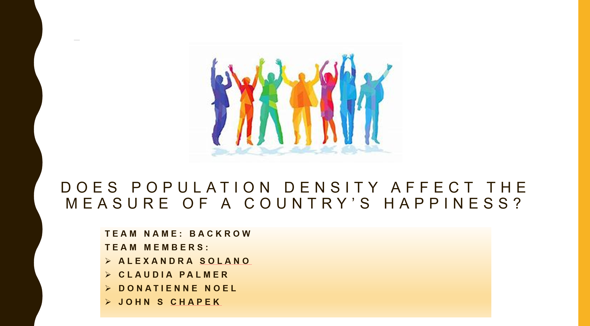

## project_1

# Does population density affect the measure of a country’s happiness?

# Data Sources
* [World Happiness Report – 2019](https://worldhappiness.report/ed/2019/)
* [World Population Review](www.worldpopulationreview.com)

# Variables
1. __Country:__ Country being studied.
2. __Ladder:__ Life evaluation is measured with a Cantril Ladder, which asks survey respondents to place the status of their lives on a “ladder” scale ranging from 0 to 10, where 0 means the worst possible life and 10 the best possible life. Positive affect comprises the average frequency of happiness, laughter and enjoyment on the previous day, and negative affect comprises the average frequency of worry, sadness and anger on the previous day. The affect measures thus lie between 0 and 1.
3. __SD of Ladder:__ Standard deviation of the Cantril Ladder results.
4. __Positive Effect:__ Comprises the average frequency of happiness, laughter and enjoyment on the previous day. The affect measures thus lie between 0 and 1.
5. __Negative Effect:__ C comprises the average frequency of worry, sadness and anger on the previous day. The affect measures thus lie between 0 and 1.
6. __Social Support:__ Variable that captures the answer to the following question: If you were in trouble, do you have relatives or friends you can count on to help you whenever you need them, or not? proportion of respondents saying Yes).
7. __Freedom:__ Variable that captures the answer to the following question: In your country, are you satisfied or dissatisfied with your freedom to choose what you do with your life? (proportion of respondents saying Yes).
8. __Corruption:__ Variable that captures the average proportion of respondents saying Yes to the following two questions: 1) Is corruption widespread within business located in your country, or not? 2) Is corruption widespread throughout the government in your country, or not?
9. __Generosity:__ A marker for a sense of positive community engagement, and a central way that humans connect with each other. Specifically, people are more likely to derive happiness from helping others when they feel free to choose whether or how to help, when they feel connected to the people they are helping, and when they can see how their help is making a difference.
10. __GDP per Capita:__ The monetary value of all finished goods and services made within a country during a specific period divided by the population. 
11. __Healthy Life Expectancy:__ The average number of years that a newborn can expect to live in “full health” – in other words, not hampered by disabling illnesses or injuries. The report uses data from the World Health Organization (“WHO”).
12. __Rank:__ Rank in density (from highest density to lowest density).
13. __Density:__ The amount of people per unit area of all land.
14. __Density per Square Mile:__ The amount of people per square mile.
15. __Population 2019:__ All the inhabitants in an area.
16. __Area:__ A region or part of a town, country, or the world.

